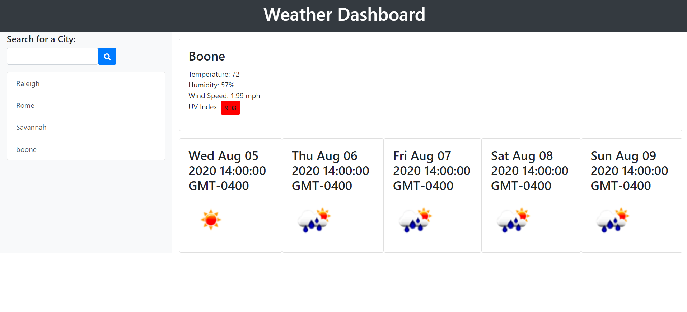

# Weather Dashboard

## About

A weather dashboard that will run in the browser and feature dynamically-updated HTML, JavaScript, and CSS. Uses the OpenWeather API to retrieve weather data for cities. The documentation includes a section called "How to start" that provides basic setup and usage instructions. Uses localStorage to store any persistent data.

## Technologies

* HTML
* JavaScript
* CSS
* JQuery

## User Story

As a traveler, I want to see the weather outlook for multiple cities so that I can plan a trip accordingly.

## Deployed Application

[Weather Dashboard](https://joneskm72.github.io/weather-dashboard/)

## Contact

Email: jones.m.kasey@gmail.com

GitHub: https://github.com/joneskm72

## License

